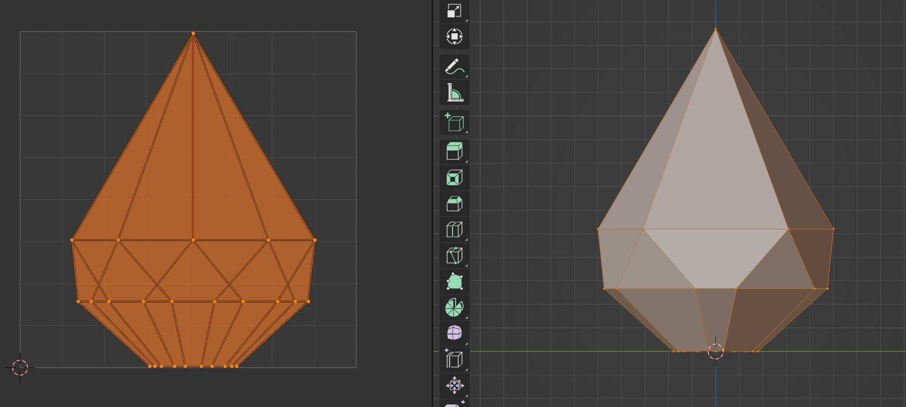
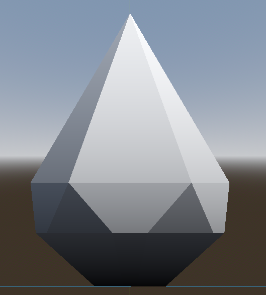

# TUNIC LIKE GRASS

## Descrption

Vertex shader that mimic bushes in the game Tunic.

Each mesh has mapped the UV so that the y is eaqual 0 at the base of the mesh.

Then displacing the vertices besed on the uv.y value, giving an input vector, I can create a similar effect.